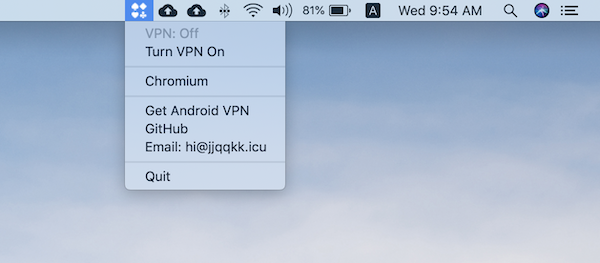

[简体中文](README.md)

# Chromium with built-in SSL VPN

This Chromium is built from source code with built-in SSL VPN enabled. Users will be able to bypass firewalls and unblock any websites with Chromium.

Chromium is Google's open-source web browser project. It is a fully functional browser on its own and supplies the vast majority of code for the Google Chrome browser.

The Chromium code is also widely used by other parties to create their own browsers. Many vendors use the code in a similar manner as Google, while others simply build it as-is and release browsers with the Chromium name.

## Get Chromium

### Use JJQQKK Launcher

JJQQKK is a smart Chromium launcher to help users download and update Chromium automatically. JJQQKK runs on Windows and macOS.

[Windows Installer](https://github.com/jjqqkk/chromium/releases/download/75.0.3770.15/JJQQKK-1.0.0.msi)

[macOS Installer](https://github.com/jjqqkk/chromium/releases/download/75.0.3770.15/JJQQKK-1.0.0.pkg)

### How to use JJQQKK

#### Windows

Run the .msi installer, follow through the installation process, then start the app and control Chromium with the system status bar icon.

#### macOS

Download the .pkg installer. Press Command and click on the file, open it up from the popup menu, and follow through the installation process. JJQQKK will start automatically after being installed, a small icon will show up in the top status bar.

### Get Chromium Manually

Download zip file from the [Release Page](https://github.com/jjqqkk/chromium/releases), and extract it to any folder you like.

On Windows, start the browser by running **chromium.exe**. You may create a shortcut to **chromium.exe**.

On macOS, double click the app to start the browser.

If you install Chromium manually, you have to check for any new release manually. 

## Share

